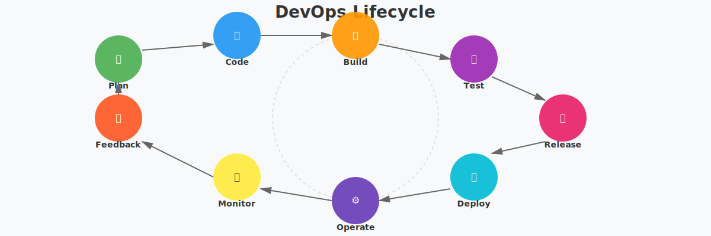
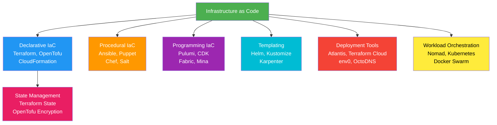

# DevOps-Tools

This repository provides the list of tools that are opensource, free or paid in nature and helps you implement Cloud/DevOps process framework for any individual or at enterprise level.

---

## What is DevOps?

DevOps is the practice of operations and development engineers participating together in the entire service lifecycle, from design through the development process to production support. [Wiki - DevOps](https://en.wikipedia.org/wiki/DevOps)

---

## DevOps Lifecycle & Tool Ecosystem

### DevOps Workflow

### Tool Categories & DevOps Stack

---

## Tools

Below are the indexes that list the tools available as per their work areas.

### Tool Deployment Models

The tools are categorized by their deployment and licensing models to help you choose the right fit:

- **Cloud-Managed**: Fully hosted solutions with automatic updates (GitHub, GitLab, CircleCI)
- **Self-Hosted**: Run on your own infrastructure for maximum control (Jenkins, Grafana, Prometheus)
- **Hybrid**: Available in both cloud and self-hosted options (Gitlab CI, New Relic, Splunk)
- **Open Source**: Free to use and modify (Kubernetes, Docker, Prometheus, Grafana)

## API Gateway

| 🔗 Tool | Description | Type | Status |
|------|-------------|------|--------|
| [Ambassador](https://www.getambassador.io/) | API Gateway for cloud-native applications that routes traffic between heterogeneous services | Commercial | Active |
| [API Umbrella](https://apiumbrella.io/#) | Proxy that sits in front of your APIs | Open Source | Active |
| [Cilium](https://github.com/cilium/cilium) | Open source software for providing and transparently securing network connectivity and loadbalancing | Open Source | CNCF Graduated |
| [Envoy](https://www.envoyproxy.io/) | Open source edge and service proxy, designed for cloud-native applications | Open Source | CNCF Graduated |
| [Gloo](https://www.gloo.us/) | Enhanced Envoy Proxy API gateway for Kubernetes (K8s) Ingress to secure microservices | Commercial | Active |
| [Kong](https://konghq.com/) | Orchestration Microservice API Gateway running in Nginx with lua-nginx-module | Open Source | Active |
| [Nginx](https://nginx.org/) | API gateway that authenticates calls, routes requests, applies rate limits, and handles SSL/TLS | Commercial | Active |
| [Traefik](https://traefik.io/) | API gateway that exposes routing, services, middlewares configuration through API handlers | Open Source | CNCF Sandbox |
| [Tyk](https://tyk.io/) | Performant and secure API management gateway for APIs and microservices | Commercial | Active |
| [APISIX](https://apisix.apache.org/) | Dynamic, real-time, high-performance open source API gateway with traffic management features | Open Source | Apache Project |
| [Krakend](https://www.krakend.io/) | Stateless, distributed, high-performance API Gateway for microservices with response aggregation | Open Source | Active |

---

## Automation Platforms

### Infrastructure as Code & Orchestration

| 🛠️ Tool | Description | Type | Best For |
|------|-------------|------|----------|
| [Ansible](https://www.ansible.com/) | Open-source provisioning, configuration management, and application-deployment tool | Open Source | Agentless automation |
| [Atlantis](https://www.runatlantis.io/) | Open source tool for safe collaboration on Terraform projects with review workflows | Open Source | Terraform governance |
| [Bosh](https://bosh.io/docs/) | Unifies release engineering, deployment, and lifecycle management of cloud software | Open Source | Complex deployments |
| [Capistrano](https://capistranorb.com/) | Remote server automation tool for application deployment | Open Source | Ruby/Rails apps |
| [Chef](https://www.chef.io/) | Configuration management tool written in Ruby and Erlang | Commercial | Enterprise automation |
| [Cloudify](https://cloudify.co/) | Open source application and network services orchestration framework based on TOSCA | Open Source | Edge networking |
| [Fabric](http://www.fabfile.org/) | Python library and command-line tool for SSH-based application deployment | Open Source | Python-based deployment |
| [Foreman](https://theforeman.org/) | Open source complete life cycle systems management tool | Open Source | Physical/virtual servers |
| [Juju](https://jaas.ai/) | Encapsulates infrastructure parts and lets them talk to each other | Commercial | Multi-cloud deployment |
| [ManageIQ](https://www.manageiq.org/) | Continuous discovery and inventory mapping for virtualization and containers | Open Source | Infrastructure discovery |
| [Mina](http://nadarei.co/mina/) | Build and run scripts to manage app deployments on servers via SSH | Open Source | Quick deployments |
| [Nomad](https://www.nomadproject.io/) | Flexible workload orchestrator for containerized and legacy applications | Open Source | Multi-cloud orchestration |
| [OctoDNS](https://github.com/github/octodns) | Tools and patterns to manage DNS records across multiple providers | Open Source | Multi-provider DNS |
| [OpenTofu](https://opentofu.org/) | Open-source, community-driven fork of Terraform with state encryption | Open Source | Terraform alternative |
| [Packer](https://www.packer.io/) | Free and open source tool for creating golden images for multiple platforms | Open Source | Image building |
| [Pulumi](https://www.pulumi.com/) | Open source IaC tool using familiar programming languages (Python, TypeScript, Go) | Open Source | Programmatic IaC |
| [Puppet](https://puppet.com/) | Software configuration management tool with declarative language | Commercial | Enterprise Config Mgmt |
| [Rundeck](https://www.rundeck.com/) | Open-source tool for defining build, deploy and manage automation | Open Source | Job scheduling |
| [Salt](https://saltproject.io/) | Python-based open source configuration management and remote execution | Open Source | Event-driven automation |
| [StackStorm](https://stackstorm.com/) | Connects all apps, services, and workflows in a unified platform | Open Source | Workflow automation |
| [Terraform](https://www.terraform.io/) | IaC tool that allows building, changing, and versioning infrastructure safely | Commercial | Infrastructure provisioning |
| [Vagrant](https://www.vagrantup.com/) | Tool for building and managing virtual machine environments | Open Source | Development environments |
| [env0](https://www.env0.com/) | Collaborative platform for managing IaC workflows (Terraform, OpenTofu, Pulumi, Ansible) | Commercial | IaC governance |

---

## Cloud Platforms

| ☁️ Provider | Description | Type | Coverage |
|----------|-------------|------|----------|
| [Alibaba Cloud](https://us.alibabacloud.com/) | Global leader in cloud computing and AI with services in 200+ countries | Commercial | Asia-Pacific focus |
| [Amazon Web Services (AWS)](https://aws.amazon.com/) | Most comprehensive cloud platform with 200+ fully featured services | Commercial | Global |
| [Apache CloudStack](https://cloudstack.apache.org/) | Open source software for deploying and managing large networks of VMs as IaaS | Open Source | On-premise |
| [Azure](https://azure.microsoft.com/) | Microsoft cloud platform with 200+ products and cloud services | Commercial | Global |
| [DigitalOcean](https://www.digitalocean.com/) | Inexpensive and easy-to-use cloud service in a well-designed environment | Commercial | Global |
| [Fly.io](https://fly.io/) | Platform for running full-stack apps and databases close to users on 30+ regions | Commercial | Global |
| [Google Cloud Platform (GCP)](https://cloud.google.com/) | Platform delivering 90+ IT services for businesses and developers | Commercial | Global |
| [IBM Cloud](https://www.ibm.com/cloud) | Open and secure public cloud with hybrid capabilities and AI features | Commercial | Global |
| [Linode / Akamai Cloud](https://www.linode.com/) | Cloud compute, storage, and networking with full-featured API and CLI | Commercial | Global |
| [Localstack](https://github.com/localstack/localstack) | Fully functional local cloud stack for offline development and testing | Open Source | Local development |
| [OpenNebula](https://opennebula.org/) | Powerful and easy-to-use open source platform to build Enterprise Clouds | Open Source | On-premise |
| [OpenStack](https://www.openstack.org/) | Open source cloud computing infrastructure software project | Open Source | On-premise |
| [Oracle Cloud](https://www.oracle.com/cloud/) | Deep and broad platform for building and running applications | Commercial | Global |
| [Scaleway](https://www.scaleway.com/) | High-quality hosting and data storage company using cloud-based technology | Commercial | Europe focus |
| [VMware Cloud / Broadcom](https://cloud.vmware.com/) | Cloud operations model for hybrid and multi-cloud environments | Commercial | Hybrid/Multi-cloud |
| [Vultr](https://www.vultr.com/) | Mission to empower developers with simplified infrastructure deployment | Commercial | Global |

---

## Containers Platforms

### Container & Kubernetes Ecosystem

| 📦 Tool | Description | Type | Purpose |
|------|-------------|------|---------|
| [Buildah](https://buildah.io/) | Open source tool for building OCI-compatible container images without daemon | Open Source | Image building |
| [containerd](https://containerd.io/) | Industry-standard container runtime with emphasis on simplicity and portability | Open Source | Container runtime |
| [Docker](https://www.docker.com/) | Open platform for developing, shipping, and running applications | Commercial | Containerization |
| [Docker Compose](https://github.com/docker/compose) | Tool for running multi-container applications defined using Compose file format | Open Source | Multi-container |
| [Dokku](http://dokku.viewdocs.io/dokku/) | Extensible, open source Platform as a Service running on a single server | Open Source | PaaS |
| [gVisor](https://gvisor.dev/) | Application kernel written in Go providing additional layer of container isolation | Open Source | Security |
| [K3S](https://k3s.io/) | Highly available, certified Kubernetes distribution for production workloads | Open Source | K8s distribution |
| [Kata Containers](https://katacontainers.io/) | Open source secure container runtime with lightweight VMs | Open Source | Secure containers |
| [Kubernetes](https://kubernetes.io/) | Open-source system for automating deployment, scaling, and management | Open Source | Orchestration |
| [LXC](https://linuxcontainers.org/) | Umbrella project behind LXD, LXC, LXCFS for Linux container technologies | Open Source | Containers |
| [OrbStack](https://orbstack.dev/) | Fast, light, and simple way to run Docker containers and Linux machines on macOS | Commercial | macOS development |
| [OpenShift](https://www.openshift.com/) | Enterprise-ready Kubernetes container platform built for open hybrid cloud | Commercial | K8s platform |
| [Podman](https://podman.io/) | Daemonless tool for managing containers, images, volumes, and pods | Open Source | Container management |
| [Rancher](https://rancher.com/) | Open source container management platform for organizations | Open Source | K8s management |
| [Skaffold](https://skaffold.dev/) | Command-line tool handling workflow for building, pushing, deploying to Kubernetes | Open Source | K8s development |

### Container Registry

| 🗂️ Tool | Description | Type | Features |
|------|-------------|------|----------|
| [Harbor](https://goharbor.io/) | Open source registry with policies, role-based access, vulnerability scanning | Open Source | Enterprise registry |
| [Quay](https://www.projectquay.io/) | Container image registry for building, organizing, distributing containers | Commercial | Image registry |
| [Chainguard Images](https://www.chainguard.dev/chainguard-images) | Minimal, hardened container images designed to reduce supply chain attack surface | Commercial | Secure images |

### Supply Chain Security

| 🔐 Tool | Description | Type | Purpose |
|------|-------------|------|---------|
| [Cosign](https://github.com/sigstore/cosign) | Tool for signing and verifying container images, part of Sigstore project | Open Source | Image signing |
| [Syft](https://github.com/anchore/syft) | CLI tool and Go library for generating Software Bill of Materials from images | Open Source | SBOM generation |
| [Sigstore](https://www.sigstore.dev/) | Free service for securing software supply chain with signing and verification | Open Source | Supply chain security |

---

## Continuous Integration and Delivery

### CI/CD Pipeline Architecture

| 🔄 Tool | Description | Type | Best For |
|------|-------------|------|----------|
| [Argo CD](https://argoproj.github.io/cd/) | Declarative, GitOps continuous delivery tool for Kubernetes | Open Source | GitOps workflows |
| [Argo Workflows](https://argoproj.github.io/workflows/) | Open source tools for Kubernetes to run workflows and do GitOps | Open Source | Workflow orchestration |
| [Bamboo](https://www.atlassian.com/software/bamboo) | Continuous delivery pipeline with resilience and scalability | Commercial | Enterprise CI/CD |
| [Bitrise](https://www.bitrise.io/) | CI/CD Platform as a Service focused on mobile app development | Commercial | Mobile CI/CD |
| [Buildkite](https://buildkite.com/) | Platform for running fast, secure, scalable CI pipelines | Commercial | Scalable pipelines |
| [Circle CI](https://circleci.com/) | CI/CD platform helping teams rapidly release code with confidence | Commercial | Cloud CI/CD |
| [Codefresh](https://codefresh.io/) | Continuous Integration/Delivery solution with Git integration | Commercial | Docker/K8s CI/CD |
| [Concourse](https://concourse-ci.org/) | CI system built with loosely coupled microservices architecture | Open Source | Complex pipelines |
| [Dagger](https://dagger.io/) | Programmable CI/CD engine running pipelines in containers | Open Source | Portable pipelines |
| [Drone](https://github.com/drone/drone) | Continuous delivery system built on container technology | Open Source | Container-native CI |
| [Flux](https://fluxcd.io/) | Continuous and progressive delivery solutions for Kubernetes | Open Source | GitOps delivery |
| [Gitlab CI](https://about.gitlab.com/product/continuous-integration/) | CI/CD that automates build, test and deploy steps | Commercial | Integrated CI/CD |
| [GitHub Actions](https://github.com/features/actions) | Automation tool for software workflows with world-class CI/CD | Commercial | GitHub native |
| [goCD](https://www.gocd.org/) | Open source continuous delivery server | Open Source | Delivery pipelines |
| [Jenkins](http://jenkins-ci.org/) | Automation server that helps build, test, and deploy software | Open Source | Traditional CI/CD |
| [PipeCD](https://pipecd.dev/) | Unified continuous delivery solution for multi-cloud | Open Source | Multi-cloud delivery |
| [Spinnaker](https://www.spinnaker.io/) | Application management and deployment for rapid releases | Commercial | Complex deployments |
| [Teamcity](https://www.jetbrains.com/teamcity/) | Build management and continuous integration server by JetBrains | Commercial | Enterprise CI |
| [Tekton](https://tekton.dev/) | Kubernetes-native open source framework for CI/CD systems | Open Source | K8s CI/CD |
| [Travis CI](https://travis-ci.org/) | Continuous integration tool for testing and deploying projects | Commercial | Testing focus |
| [werf](https://werf.io/) | Consistent delivery tool gluing Git, Docker, Helm & Kubernetes | Open Source | Kubernetes delivery |
| [Woodpecker CI](https://woodpecker-ci.org/) | Community fork of Drone CI with native container support | Open Source | Container CI/CD |

---

## FinOps & Cost Management

| 💰 Tool | Description | Type | Focus |
|------|-------------|------|-------|
| [CloudHealth by VMware](https://cloudhealth.vmware.com/) | Unified platform for managing cloud cost, usage, security, and performance | Commercial | Multi-cloud management |
| [Infracost](https://www.infracost.io/) | Open source tool showing cloud cost estimates for Terraform projects | Open Source | Terraform costs |
| [Kubecost](https://www.kubecost.com/) | Real-time cost visibility and insights into Kubernetes environments | Commercial | K8s cost tracking |
| [OpenCost](https://www.opencost.io/) | Vendor-neutral open source CNCF project for measuring cloud infrastructure costs | Open Source | Cost measurement |
| [Vantage](https://www.vantage.sh/) | Cloud cost transparency platform consolidating costs across cloud providers | Commercial | Cost optimization |

---

## GitOps & Progressive Delivery

| 🔀 Tool | Description | Type | Specialization |
|------|-------------|------|-----------------|
| [Argo CD](https://argoproj.github.io/cd/) | Declarative GitOps continuous delivery tool keeping cluster state in sync | Open Source | GitOps sync |
| [Argo Rollouts](https://argoproj.github.io/rollouts/) | Advanced deployment capabilities with blue-green, canary, and progressive delivery | Open Source | Progressive deployments |
| [Flagger](https://flagger.app/) | Progressive delivery tool automating release process with canary and A/B testing | Open Source | Canary deployments |
| [Flux](https://fluxcd.io/) | CNCF graduated GitOps tool continuously reconciling cluster state | Open Source | Declarative GitOps |
| [Weave GitOps](https://www.weave.works/product/gitops/) | Extends Flux with developer-friendly UI and enterprise features | Commercial | Enterprise GitOps |

---

## Incident Management

| 🚨 Tool | Description | Type | Features |
|------|-------------|------|----------|
| [Grafana OnCall](https://grafana.com/products/oncall/) | Open source on-call management tool with alert routing and escalation | Open Source | On-call management |
| [Incident.io](https://incident.io/)) | Modern incident management platform with Slack integration | Commercial | Incident coordination |
| [OpsGenie](https://www.opsgenie.com/) | Modern incident management ensuring critical incidents are never missed | Commercial | Alert management |
| [PagerDuty](https://www.pagerduty.com/) | Operations performance platform with visibility across incident lifecycle | Commercial | Enterprise incident mgmt |
| [PagerTree](https://pagertree.com/) | On-call incident management with flexible schedules and reliable notifications | Commercial | On-call scheduling |
| [Rootly](https://rootly.com/) | Incident management platform automating response workflows in Slack | Commercial | Incident automation |
| [StatusPal](https://www.statuspal.io/) | Status page and incident communication platform for DevOps teams | Commercial | Status pages |
| [VictorOps / Splunk On-Call](https://victorops.com/) | Real-time incident management platform combining people and data | Commercial | Real-time incident mgmt |

---

## Internal Developer Platforms

| 🏗️ Platform | Description | Type | Purpose |
|----------|-------------|------|---------|
| [Backstage](https://backstage.io/) | Open source framework for building developer portals unifying tooling | Open Source | Developer portal |
| [Cortex](https://www.cortex.io/) | Internal Developer Portal improving service quality and ownership tracking | Commercial | Service catalog |
| [Humanitec](https://humanitec.com/) | Platform orchestrator enabling platform engineering teams | Commercial | Platform orchestration |
| [Port](https://www.getport.io/) | Developer portal for building centralized catalog of resources | Commercial | Resource catalog |
| [Radius](https://radapp.io/) | Open source cloud-native application platform for multi-environment deployment | Open Source | App deployment |
| [Kratix](https://kratix.io/) | Open source framework for building platforms on Kubernetes | Open Source | Platform engineering |

---

## Messaging Queue

| 📨 Tool | Description | Type | Use Case |
|------|-------------|------|----------|
| [ActiveMQ](http://activemq.apache.org/) | Most popular open source multi-protocol Java-based message broker | Open Source | Enterprise messaging |
| [Beanstalkd](https://beanstalkd.github.io/) | Simple, fast work queue for reducing latency with async task processing | Open Source | Task queue |
| [Celery](https://docs.celeryq.dev/) | Open source asynchronous task queue based on distributed message passing | Open Source | Async tasks |
| [Faktory](https://github.com/contribsys/faktory) | Work server and repository for background jobs within applications | Commercial | Background jobs |
| [Kafka](http://kafka.apache.org/) | Distributed event streaming platform for high-performance data pipelines | Open Source | Event streaming |
| [NATS](https://nats.io/) | Connective technology for secure communication across cloud, on-prem, edge | Open Source | Messaging connectivity |
| [NSQ](https://nsq.io/) | Realtime distributed messaging platform designed to operate at scale | Open Source | Real-time messaging |
| [Pulsar](https://pulsar.apache.org/) | Distributed messaging and streaming platform built for the cloud | Open Source | Cloud streaming |
| [RabbitMQ](https://www.rabbitmq.com/) | Messaging broker providing common platform for send/receive messages | Open Source | Message brokering |
| [Redpanda](https://redpanda.com/) | Kafka-compatible streaming platform written in C++ for high-throughput | Commercial | High-performance streaming |

---

## Monitoring & Observability

### Observability Stack

| 📊 Tool | Description | Type | Category |
|------|-------------|------|----------|
| [Alerta](https://github.com/alerta/alerta) | Accepts alerts from multiple sources with aggregation and correlation | Open Source | Alerting |
| [Cachet](https://github.com/CachetHQ/Cachet) | Beautiful and powerful open source status page system | Open Source | Status pages |
| [cAdvisor](https://github.com/google/cadvisor) | Container Advisor providing resource usage and performance understanding | Open Source | Container metrics |
| [Datadog](https://www.datadoghq.com/) | Observability and security platform with monitoring, APM, logs, security | Commercial | Full observability |
| [Fluentd](https://www.fluentd.org/) | Open source data collector unifying data collection and consumption | Open Source | Log collection |
| [Grafana](https://grafana.com/) | Open source interactive data-visualization platform with dashboards | Open Source | Visualization |
| [Grafana Loki](https://grafana.com/oss/loki/) | Horizontally scalable multi-tenant log aggregation system | Open Source | Log aggregation |
| [Grafana Tempo](https://grafana.com/oss/tempo/) | Open source high-scale distributed tracing backend | Open Source | Tracing |
| [Graylog](https://www.graylog.org/) | Fully integrated open source log management platform | Open Source | Log management |
| [Healthchecks](https://github.com/healthchecks/healthchecks) | Cron job monitoring service listening for pings from scheduled tasks | Open Source | Uptime monitoring |
| [Icinga](https://icinga.com/) | Monitoring system checking availability and generating performance data | Open Source | Infrastructure monitoring |
| [InfluxData](https://www.influxdata.com/) | Platform for developing time series applications | Commercial | Time series database |
| [Jaeger](https://www.jaegertracing.io/) | Open source end-to-end distributed tracing system | Open Source | Distributed tracing |
| [Kibana](https://www.elastic.co/products/kibana) | Free and open user interface for visualizing Elasticsearch data | Open Source | Log visualization |
| [Logstash](https://www.elastic.co/products/logstash) | Free and open server-side data processing pipeline | Open Source | Log processing |
| [Nagios](https://www.nagios.org/) | Open source monitoring system for computer systems | Open Source | System monitoring |
| [Netdata](https://www.netdata.cloud/) | Open source tool collecting real-time metrics with live charts | Open Source | Real-time monitoring |
| [New Relic](https://newrelic.com/) | Cloud-based observability platform with monitoring, APM, logs | Commercial | Full observability |
| [OpenTelemetry](https://opentelemetry.io/) | CNCF project for instrumenting and exporting telemetry data | Open Source | Observability framework |
| [Prometheus](https://prometheus.io/) | Free software for event monitoring and alerting | Open Source | Metrics & alerting |
| [Sensu](https://sensu.io/) | Open source infrastructure and application monitoring solution | Open Source | Monitoring platform |
| [Sentry](https://sentry.io/welcome/) | Open-source error tracking helping developers monitor and fix crashes | Open Source | Error tracking |
| [SonarQube](https://www.sonarsource.com/products/sonarqube/) | Platform for continuous code quality inspection and analysis | Commercial | Code quality |
| [Upright](https://github.com/basecamp/upright) | Open-source synthetic monitoring system from Basecamp | Open Source | Synthetic monitoring |
| [Zabbix](https://www.zabbix.com/) | Open source monitoring software tool for IT components | Open Source | Enterprise monitoring |

---

## Operating Systems

| 🐧 OS | Description | Type | Use Case |
|----|-------------|------|----------|
| [Alpine Linux](https://www.alpinelinux.org/) | Security-oriented, lightweight Linux distribution based on musl | Open Source | Container images |
| [Bottlerocket](https://bottlerocket.dev/) | Free and open-source Linux OS from AWS purpose-built for containers | Open Source | Container hosts |
| [CentOS Stream](https://www.centos.org/) | Continuously-delivered distro tracking RHEL development | Open Source | Production servers |
| [Fedora CoreOS](https://fedoraproject.org/coreos/) | Fedora Edition built specifically for running containerized workloads | Open Source | Container orchestration |
| [Flatcar Container Linux](https://www.flatcar.org/) | Community-driven immutable Linux distribution for containers at scale | Open Source | Container infrastructure |
| [Photon OS](https://github.com/vmware/photon) | Open source Linux container host optimized for cloud-native applications | Open Source | VMware environments |
| [Talos Linux](https://www.talos.dev/) | Modern OS designed specifically for Kubernetes with API-only management | Open Source | K8s nodes |
| [Ubuntu](https://ubuntu.com/) | Modern open source operating system for servers, desktops, cloud, IoT | Open Source | General purpose |

---

## Programming Languages

| 💻 Language | Description | Focus | DevOps Usage |
|----------|-------------|-------|--------------|
| [Go](https://golang.org/) | Robust system-level language for network servers and distributed systems | Systems | Kubernetes, Docker, Terraform |
| [Python](https://www.python.org/) | For websites, software, automation, data analysis, and visualization | Scripting | Automation, scripting |
| [Ruby](https://www.ruby-lang.org/) | Most used for web applications and DevOps tools | Web & DevOps | Chef, Capistrano |
| [Rust](https://www.rust-lang.org/) | Systems programming focused on safety, speed, and concurrency | Systems | High-performance tooling |
| [TypeScript / JavaScript (Node.js)](https://nodejs.org/) | For DevOps tooling and infrastructure definitions | Multi-purpose | Pulumi, AWS CDK |

---

## Security & Compliance (DevSecOps)

### DevSecOps Pipeline & Security Stack

| 🔒 Tool | Description | Type | Focus Area |
|------|-------------|------|------------|
| [Aqua Security](https://www.aquasec.com/) | Cloud-native security platform for containers, serverless, VMs | Commercial | Container security |
| [Checkov](https://www.checkov.io/) | Static code analysis tool for IaC security and compliance | Open Source | IaC scanning |
| [Falco](https://falco.org/) | Open source cloud-native runtime security tool detecting unexpected behavior | Open Source | Runtime security |
| [HashiCorp Vault](https://www.vaultproject.io/) | Tool for securely accessing secrets and managing encryption keys | Open Source | Secrets management |
| [Infisical](https://infisical.com/) | Open source secrets management platform with rotation and audit logs | Open Source | Secrets management |
| [Snyk](https://snyk.io/) | Developer security platform integrating with pipelines and registries | Commercial | Vulnerability scanning |
| [Trivy](https://trivy.dev/) | Open source all-in-one security scanner for containers and IaC | Open Source | Vulnerability scanning |
| [Wiz](https://www.wiz.io/) | Agentless cloud security platform scanning entire cloud environments | Commercial | Cloud security |

---

## Service Mesh & Networking

| 🌐 Tool | Description | Type | Architecture |
|------|-------------|------|--------------|
| [Cilium](https://cilium.io/) | CNCF graduated project providing eBPF-based networking and security | Open Source | Network security |
| [Istio](https://istio.io/) | Open source service mesh layering transparently for traffic management | Open Source | Service mesh |
| [Kuma](https://kuma.io/) | CNCF sandbox universal service mesh built on Envoy | Open Source | Service mesh |
| [Linkerd](https://linkerd.io/) | CNCF graduated ultra-lightweight service mesh for Kubernetes | Open Source | Lightweight mesh |
| [Tailscale](https://tailscale.com/) | Zero-config VPN built on WireGuard for encrypted networking | Commercial | VPN/networking |

---

## Source Control Management

| 📚 Platform | Description | Type | Features |
|----------|-------------|------|----------|
| [Bitbucket](https://bitbucket.org/product/) | Git-based code hosting tool with Jira and Trello integration | Commercial | Team collaboration |
| [Forgejo](https://forgejo.org/) | Self-hosted lightweight code hosting, community fork of Gitea | Open Source | Self-hosted git |
| [Gitea](https://gitea.io/) | Community managed lightweight code hosting solution | Open Source | Self-hosted git |
| [GitHub](https://github.com/) | Git repository hosting with Actions, Codespaces, and Copilot | Commercial | Full-featured platform |
| [GitLab](https://gitlab.com/) | Complete DevOps platform with source control, CI/CD, security | Commercial | Integrated DevOps |
| [Gogs](https://gogs.io/) | Lightweight self-hosted Git service written in Go | Open Source | Self-hosted git |
| [Perforce Helix Core](https://www.perforce.com/products/helix-core) | Enterprise version control for large binaries and massive codebases | Commercial | Enterprise VCS |

---

*Last updated: June 2026*
